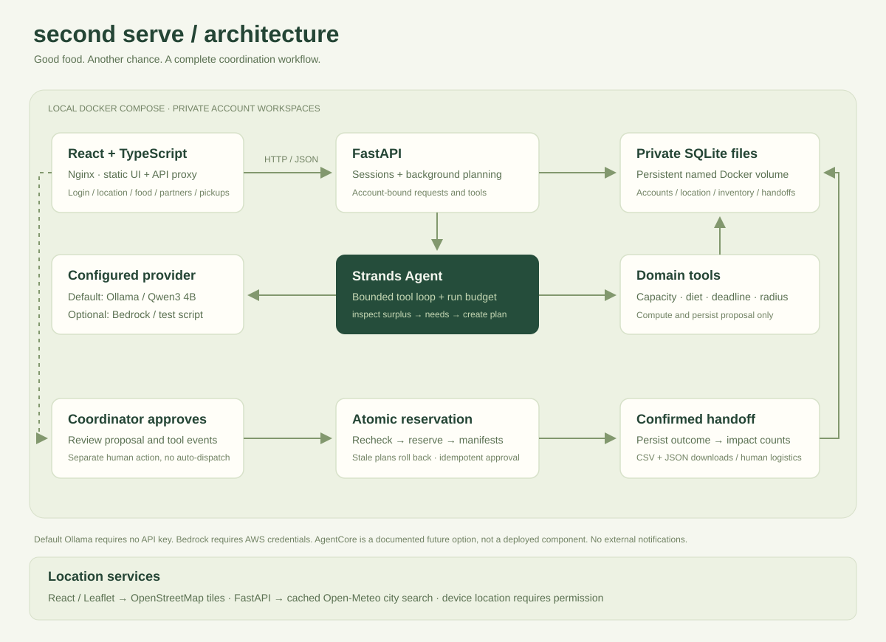
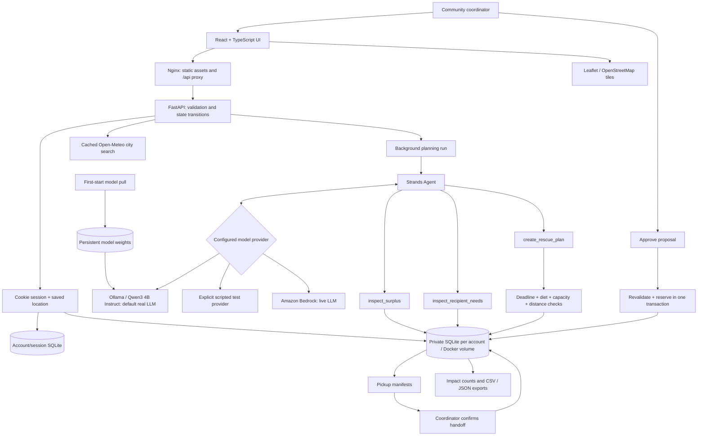

# Architecture

## Boundaries

- **Frontend container:** Node builds React/TypeScript into static assets. Nginx serves them and proxies relative `/api` requests. Browser credentials never include AWS keys.
- **Backend container:** FastAPI validates input using Pydantic. Strands runs in a background task so the UI can poll tool events. One worker owns the process lifecycle.
- **Model boundary:** `AGENT_MODE=ollama` invokes the real local Qwen model by default, over the private Docker network. `bedrock` optionally sends prompts including entered records to AWS. `demo` makes no inference calls and is selected explicitly for unit tests. No mode silently falls back to demo.
- **Agent permissions:** three custom tools can read domain state and save a proposal. The agent cannot approve itself, create arbitrary SQL, dispatch email, or run shell commands.
- **Approval boundary:** hard constraints are rechecked in a SQLite `BEGIN IMMEDIATE` transaction. All reservations and mission rows succeed or roll back together. The authenticated account owns the proposal and all affected records; another account cannot inspect or approve it.
- **Persistence:** accounts and hashed sessions use a central SQLite file. Each account owns a private SQLite database for donations, recipients, runs, events, missions and location settings in the named Docker volume. Strands tool functions explicitly bind this path even in executor threads. SQLite foreign keys and nonnegative quantities are enforced.
- **Location boundary:** geocoding is user-triggered and cached. New accounts start empty; sample records are explicit and fictional. Changing area filters inventory without moving records, and invalidates approval of a plan from another area. Browser geolocation needs permission; no IP lookup or silent city guess occurs.
- **Model audit:** the saved run records the selected model ID, completed model-response count, elapsed time, requested tool names and final answer. A before-model hook bounds calls and an after-model hook records actual provider response events. Local readiness is checked before a run is created. A compatibility adapter preserves grouped tool requests for the pinned SDK. If the model stops before saving a proposal, at most two feedback turns ask the same LLM to finish; the overall call budget still applies. The model can resolve a coordinator-preferred partner to a database ID; domain code validates it and still enforces every allocation constraint.
- **Observed events:** the visible timeline records tool outcomes and operational events. It is not a display of private model reasoning.

## Run lifecycle

`running → ready → dispatched`; planning exceptions or process restarts produce `failed`. Empty plans can be inspected but cannot be approved. Approval is idempotent. A dispatched run contains `scheduled` missions; each handoff transitions a mission to `completed` idempotently.

Run events and proposals are durable. The execution queue is not: this version uses FastAPI background tasks. Restart recovery deliberately marks interrupted jobs failed rather than implying an unfinished job will resume.

## Optional AgentCore evolution

AgentCore is **not deployed or required** in this prototype. To adopt it, move the Strands invocation behind an AgentCore Runtime entrypoint, expose domain tools through an authenticated service, keep durable application state outside ephemeral runtime storage, and add runtime identity and telemetry. The present SQLite volume should remain on the application host or be replaced with an appropriate durable managed store. Do not put this SQLite file on an ephemeral serverless filesystem and claim persistent state.

The submitted architecture diagram reflects the implementation that exists, with Bedrock as a configured optional model provider. It does not claim AgentCore scoring credit for an undeployed component.
